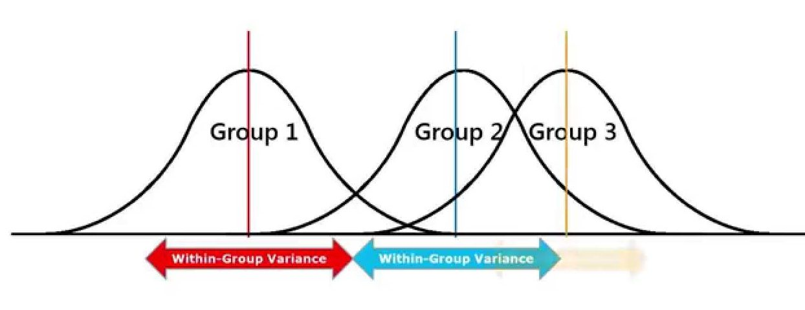

<center>

</center>


```{r, message = FALSE, warning=FALSE}
library(tidyverse)
library(janitor)
library(viridis)
library(plotly)
library(ggplot2)
knitr::opts_chunk$set(
	echo = TRUE,
	warning = FALSE,
	fig.width = 8, 
  fig.height = 6,
  out.width = "90%"
)
options(
  ggplot2.continuous.colour = "viridis",
  ggplot2.continuous.fill = "viridis"
)
scale_colour_discrete = scale_colour_viridis_d
scale_fill_discrete = scale_fill_viridis_d
theme_set(theme_minimal() + theme(legend.position = "bottom"))

```

```{r, message = FALSE, warning=FALSE}
payroll_data = 
    read_csv("data/payroll_data.csv")
```


## ANOVA Analysis

For additional analysis, an ANOVA was done to determine whether there is a significant difference in mean base salary for municipal workers between the counties in New York State in 2022.  

Null Hypothesis(Ho) =  All the base salary means for each county are equal.  

Alternative Hypothesis(H1) = Not all the base salary means for each county are equal.

```{r, message = FALSE, warning=FALSE}
ms_model = 
  payroll_data %>%
  mutate(county_name = as.factor(county_name)) %>%
  group_by(county_name) %>%
  summarise(ms_mean = base_salary)

res = lm(ms_mean ~ factor(county_name), data = ms_model)

anova_analysis = 
    anova(res) %>% 
    broom::tidy() %>% 
    knitr::kable(caption = "Table for ANOVA Test")

anova_analysis
```

## Tukey Test 

```{r, message = FALSE, warning=FALSE}
res1 = aov(ms_mean ~ factor(county_name), data = ms_model)

tukey_ms = TukeyHSD(res1)

tukey_table = 
    tukey_ms %>% 
    broom::tidy() %>%
    select(-term) |> 
    knitr::kable(caption = "Table for Tukey Test ")

tukey_table
```
